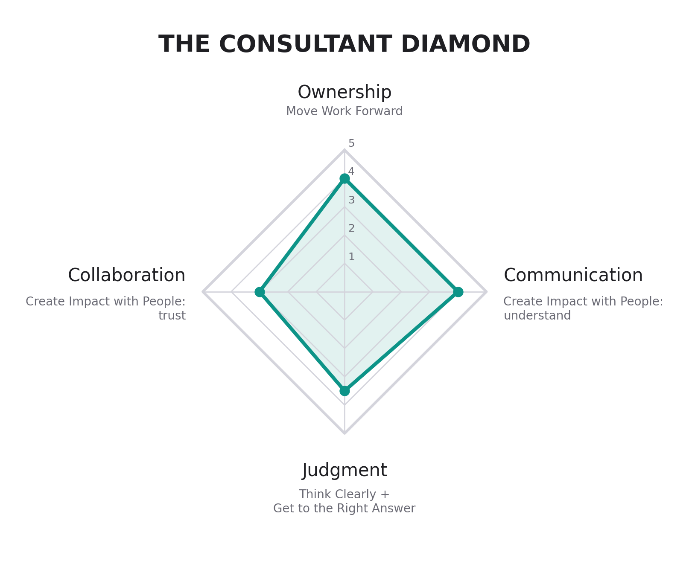

*How top consultants work, and what the people around them notice: four axes, the skills under each, and the behaviors that build them.*

## What Is the Consultant Diamond? {#consultant-diamond}

The Consultant diamond describes how good consultants work. The same four axes apply to a case interview, a networking conversation, and a client recommendation. You will apply it in two contexts:

1. **Landing a consulting offer** through networking, resume building, and interview preparation
2. **Delivering real impact** by building consulting proposals and pitch decks using outside-in analysis

The same Judgment that structures a case interview structures a client recommendation. The same Collaboration that makes you good at networking builds trust with stakeholders.

The diamond has three layers, and the rest of the course follows them:

1. **Four axes** the people you work with can see and rate: Judgment, Ownership, Communication, Collaboration.
2. **Toolkit components**: the eight named skills under those axes.
3. **Core actions**: the concrete behaviors you practice to build each skill.

Each axis is rated 1 to 5 by someone who watched you work (a teammate, a client, a manager) against written behavioral anchors.

{fig-alt="A diamond-shaped radar chart with four axes rated 1 to 5: Judgment at the top, Communication on the right, Ownership at the bottom, Collaboration on the left." width="70%"}

| Axis | The Question | Judged On | Toolkit Components | Chapters |
|:-----|:-------------|:----------|:-------------------|:---------|
| **Judgment** | Is this the right work, and is the answer right? | Whether you solve the right problem and say what the facts support | Structured Problem-Solving, Analytics & Modeling | [1](05-structured-problem-solving.qmd), [2](06-analytics-modeling.qmd) |
| **Ownership** | Does the work move? | Whether you drive the work | Workstream Ownership, Tolerance for Ambiguity | [3](07-ownership.qmd) |
| **Communication** | Do people understand it? | The artifacts: what you produce for a reader (updates, decks, memos) | Clear Communication | [4](08-communication.qmd) |
| **Collaboration** | Do people trust you, and do they want you on the next one? | How your team and your client experience working with you | Client Hands, Teamwork & Collaboration, Coachability | [5](09-collaboration.qmd) |

The work sits on the vertical axis: Judgment asks whether it is the right work, and Ownership asks whether it moves. The people sit on the horizontal axis: Communication asks whether they understand the work and is judged on the artifact; Collaboration asks whether they trust you and is judged on the relationship, with anyone you work with, teammate or client.

A reviewer can hold four judgments and mean them; asked for more, most reviewers give every item the same score. That is why the diamond has four axes. The eight toolkit components stay as the skills you build, and the diamond is the smaller set of things another person can observe and rate.

### The Anchors

Same 1 to 5 scale on every axis. No adjectives like "strong" or "excellent." Every level is something a reviewer could point at in a week of work, which is what makes two different reviewers land in the same place.

#### Judgment

1. Solves the problem as handed over, even when it is the wrong one. Conclusions run ahead of the evidence.
2. Sound on the task in front of them, but does not ask whether it is the right task. Reports what the data says, not what it means.
3. Checks that the question is the right one before starting. Conclusions follow from the evidence, and they say where it is thin.
4. Reframes the problem when the facts call for it. Separates what is known from what is assumed; recommendations hold up when tested.
5. The team or client changes direction because of how they framed it. Says what the facts support when it is not what anyone hoped.

#### Ownership

1. Waits to be told. Work stops when the next step is unclear. Blockers surface at the deadline rather than before it.
2. Does assigned tasks well but does not extend past them. Asks what to do next rather than proposing it.
3. Owns a defined piece and finishes it. Raises blockers early. Still needs the plan handed to them.
4. Owns a workstream end to end. Makes the plan, unblocks themselves, and reports what they decided rather than asking what to do.
5. Owns a workstream and pulls others along. Reprioritizes when the client changes direction, and what comes back is better than what was asked for.

#### Communication

1. Updates are late or absent. The reader has to ask what happened.
2. Reports activity in the order it happened. The reader has to extract the point themselves.
3. Answer first, support underneath. Someone who reads only the first line knows the state of the work.
4. Writes for the specific reader. Names the decision being asked for, and the memo or deck holds up without anyone narrating it.
5. Produces the artifact the team reuses. A senior stakeholder can act on it without a meeting.

#### Collaboration

1. Works alone; the team and the client find out late. Takes feedback as criticism, or agrees and changes nothing.
2. Does their own part and reacts when asked. Leaves teammates' work and the client relationship to others; applies feedback only where told.
3. Reliable to work with. Keeps commitments to teammates and the client, shares context without being chased, and acts on feedback the next time.
4. Makes the people around them better. Asks for feedback before it is offered, says early what will not fit, and teammates and the client come to them directly.
5. People ask to work with them again, by name. Handles disagreement without it becoming personal, changes position when someone else is right, and surfaces a risk before anyone else finds it.

Collaboration covers everyone you work with, teammates and the client alike. It is about the trust built over the whole engagement, so you can be quiet in a client meeting and still rate a 4 if the client relies on you between meetings.

### Using the Diamond

A 3 on every axis describes a reliable teammate who does what is asked. A 4 describes someone who reframes the problem when the facts call for it, owns a workstream, writes something a stakeholder can act on, and makes the team and the client around them better.

- **Rate yourself** against the anchors, then point to a specific instance for each rating. If you cannot name the instance, the rating is a guess.
- **Give feedback** to pod members and teammates on the axis where you saw something specific, using the [SBI model](04-working-as-a-team.qmd#giving-and-receiving-feedback).
- **Prepare behavioral stories** with the diamond in mind. "Are you someone we'd want to work with on our team?" is a Collaboration question, and a story about owning a workstream end to end is an Ownership story.

## The 7-Step Problem-Solving Process

At the heart of Judgment is structured problem-solving. McKinsey's 7-step process is among the most influential problem-solving frameworks in consulting, and variations of it appear across firms and business schools.

| Step | Name | Description | Diamond Axis |
|:----:|:-----|:------------|:-------------|
| 0 | Diagnose the current state | Understand what is happening and why before defining the problem | Judgment |
| 1 | Define the problem | Write a clear, precise problem statement that specifies what decision must be made, under what constraints, and by when | Judgment |
| 2 | Disaggregate the problem | Break the problem into mutually exclusive, collectively exhaustive (MECE) components so the team can work in parallel and think clearly | Judgment |
| 3 | Prioritize the issues | Focus on the branches that matter most: those with the biggest impact and that are realistically changeable | Judgment |
| 4 | Develop a work plan | Decide what analyses to run, who will do them, how deep to go, and on what timeline (with iteration built in) | Ownership |
| 5 | Conduct the analysis | Start with simple heuristics and descriptive statistics, then move to deeper analysis as needed; constantly test assumptions | Judgment |
| 6 | Synthesize the findings | Integrate results into a coherent, insight-driven answer (not just analysis), clearly addressing "What should we do?" | Communication |
| 7 | Communicate and motivate action | Tell a compelling story, acknowledge uncertainty, and drive alignment so the organization actually acts on the recommendation | Communication |

Throughout this course, we build on the 7-step process. Core actions aligned to specific steps are annotated with **(0)** through **(7)**.

Read down the last column and you see the order the work flows: Judgment frames the problem, Ownership plans the work, Judgment answers it, and Communication turns the answer into something people act on.

But problem-solving is only part of the story. The diamond extends beyond analytical rigor to include the professional behaviors that turn good analysis into real impact: owning your work, navigating ambiguity, building trust, and communicating with clarity. These capabilities are what separate consultants who deliver insight from those who drive change.

Two foundational concepts appear throughout the course: the Pyramid Principle for communication and MECE for structure. You'll see these referenced with symbols in the core actions.

## The Pyramid Principle

The Pyramid Principle, developed by Barbara Minto at McKinsey, is a communication framework that structures ideas top-down: **lead with the answer, then support it with evidence**. Instead of building to a conclusion, you state your recommendation first, then group supporting arguments into logical clusters. This approach respects your audience's time, makes your logic transparent, and ensures your message lands even if the conversation gets cut short. Every slide, email, and verbal update in consulting follows this pattern.

## MECE (Mutually Exclusive, Collectively Exhaustive)

MECE is the gold standard for structuring problems. **Mutually Exclusive** means categories don't overlap, so each item belongs in exactly one bucket. **Collectively Exhaustive** means the categories cover everything, so nothing falls through the cracks. When you build an issue tree, segment a market, or structure a case, MECE ensures you've carved the problem into clean, complete pieces. If your structure isn't MECE, you'll either double-count (overlapping) or miss something important (gaps). Being perfectly MECE isn't always possible, but striving for it forces clarity and exposes flaws in your thinking.

## Symbol Legend

| Symbol | Meaning |
|:-------|:--------|
| **(n)** | 7-Step Problem-Solving Process step number |
| 🔺 | Pyramid Principle (top-down, answer-first logic) |
| ◯ ◯ | MECE logic (complete, non-overlapping structure) |

## Core Actions by Axis

Each axis holds one or more toolkit components, and each component holds the core actions you practice. Every core action has its own section in the chapters; the numbers match.

### Judgment

**Structured Problem-Solving**: Decompose ambiguous problems using MECE logic and hypothesis-driven thinking

| Core Action | Description |
|:------------|:------------|
| [1.1 Diagnose the Current State](05-structured-problem-solving.qmd#os-1-1) **(0)** 🔺 | Understand what's happening and why |
| [1.2 Define the Problem](05-structured-problem-solving.qmd#os-1-2) **(1)** 🔺 | Identify the gap between current and desired state |
| [1.3 Frame the Problem](05-structured-problem-solving.qmd#os-1-3) **(1)** 🔺 | Articulate the decision set, constraints, and scope |
| [1.4 State a Day-1 Hypothesis](05-structured-problem-solving.qmd#os-1-4) 🔺 | Form a provisional view about which decision to make |
| [1.5 Articulate "What Would Have to Be True"](05-structured-problem-solving.qmd#os-1-5) **(3)** 🔺 | Make your critical assumptions explicit and testable |
| [1.6 Disaggregate into MECE Issues](05-structured-problem-solving.qmd#os-1-6) **(2)** ◯ ◯ | Break hypotheses into non-overlapping, comprehensive components |
| [1.7 Prioritize by Decision Impact](05-structured-problem-solving.qmd#os-1-7) **(3)** ◯ ◯ | Focus on what would actually change the answer |
| [1.8 Exclude Non-Decision Questions](05-structured-problem-solving.qmd#os-1-8) | Know what NOT to analyze |

**Analytics & Modeling**: Build models in Excel, Python, or other quantitative tools; test hypotheses against data; estimate with confidence

| Core Action | Description |
|:------------|:------------|
| [2.1 Design Hypothesis-Testing Analyses](06-analytics-modeling.qmd#os-2-1) **(5)** 🔺 | Build analyses that will prove or disprove critical assumptions |
| [2.2 Build an Outside-In Fact Base](06-analytics-modeling.qmd#os-2-2) **(5)** | Gather external data before relying on internal opinions |
| [2.3 State Assumptions Explicitly](06-analytics-modeling.qmd#os-2-3) **(5)** ◯ ◯ | Make your assumptions visible and find good proxies |
| [2.4 Bound Answers with Quick Math](06-analytics-modeling.qmd#os-2-4) **(5)** | Establish reasonable ranges before building complex models |
| [2.5 Build Models and Run Sensitivities](06-analytics-modeling.qmd#os-2-5) **(5)** ◯ ◯ | Test how sensitive outcomes are to key assumptions |

### Ownership

**Workstream Ownership**: Act with high agency by owning a workstream end-to-end; anticipate needs and drive outcomes without waiting to be told

| Core Action | Description |
|:------------|:------------|
| [3.1 Create a Workplan](07-ownership.qmd#os-3-1) **(4)** 🔺 | Convert structured thinking into owners, deliverables, and deadlines |
| [3.2 Own Your Workstream](07-ownership.qmd#os-3-2) | Take full responsibility from question to answer |
| [3.3 Sequence for Early Insight](07-ownership.qmd#os-3-3) | Generate useful findings as early as possible |
| [3.4 Reprioritize Dynamically](07-ownership.qmd#os-3-4) | Adapt to new information without losing momentum |
| [3.5 Anticipate Risks and Bottlenecks](07-ownership.qmd#os-3-5) | Identify problems before they become crises |
| [3.6 Manage Up](07-ownership.qmd#os-3-6) | Surface what your manager needs to know |

**Tolerance for Ambiguity**: Navigate uncertainty; make progress without complete information

| Core Action | Description |
|:------------|:------------|
| [3.7 Move Without Certainty](07-ownership.qmd#os-3-7) | Progress with best-available information |

### Communication

**Clear Communication**: Synthesize findings into an answer; apply the Pyramid Principle; write action-titled slides; deliver crisp verbal updates; tailor the message to the reader

| Core Action | Description |
|:------------|:------------|
| [4.1 Synthesize into Clear Answers](08-communication.qmd#os-4-1) **(6)** 🔺 | Climb from data to insight to recommendation |
| [4.2 Craft a Storyline](08-communication.qmd#os-4-2) **(6)** 🔺 | Build a narrative arc from situation to recommendation |
| [4.3 Communicate with Executive Brevity](08-communication.qmd#os-4-3) **(7)** 🔺 | Lead with the answer, support with evidence |
| [4.4 Tailor to Stakeholders](08-communication.qmd#os-4-4) **(7)** 🔺 | Different audiences need different messages |

### Collaboration

**Client Hands**: Interact professionally with senior stakeholders; build trust through credibility

| Core Action | Description |
|:------------|:------------|
| [5.1 Build Trust](09-collaboration.qmd#os-5-1) | Demonstrate judgment, reliability, and empathy |
| [5.2 Prewire Stakeholders](09-collaboration.qmd#os-5-2) | Never surprise decision-makers in a meeting |
| [5.3 Navigate Difficult Conversations](09-collaboration.qmd#os-5-3) | Deliver hard messages constructively |

**Teamwork & Collaboration**: Collaborate effectively with team members and other stakeholders; give and receive feedback

| Core Action | Description |
|:------------|:------------|
| [5.4 Coordinate as a Team](09-collaboration.qmd#os-5-4) | Present with consistent messaging and smooth handoffs |

**Coachability**: Incorporate feedback rapidly; demonstrate growth through iteration

| Core Action | Description |
|:------------|:------------|
| [5.5 Seek Feedback](09-collaboration.qmd#os-5-5) | Constantly improve through input from others |

## Translating Your Experiences to Consulting Language

Many BYU students served full-time missions, and that experience provides rich examples of consulting skills in action. If you're a returned missionary, this section helps you translate those experiences into consulting language. If you didn't serve a mission, the same toolkit components develop through any intensive experience—work, leadership roles, athletics, service, or other challenges. What matters is identifying *your* experiences that demonstrate these skills.

### For Returned Missionaries

Mission service maps directly to the consulting toolkit. Firms value these experiences when you articulate them in professional terms:

| Toolkit Component | Axis | Missionary Experience | Consulting Parallel |
|:------------------|:-----|:----------------------|:--------------------|
| **Teamwork & Collaboration** | Collaboration | Working 24/7 with a companion; companion inventory (giving/receiving honest feedback) | Intense team-based case work; direct feedback culture; working with teammates you didn't choose |
| **Tolerance for Ambiguity** | Ownership | Short transfers every 6 weeks–3 months; whitewashing new areas with no contacts; constant rejection | Project-based engagements with new teams and industries; starting from scratch; resilience in networking |
| **Client Hands** | Collaboration | Being looked to for leadership at 19-21; working with Mission President and stake leaders; handling criticism calmly | Junior consultants presenting to executives; managing stakeholders you don't control; composure under pressure |
| **Clear Communication** | Communication | Teaching the same principles differently based on the person; memorizing and adapting lesson frameworks | Tailoring messages to different audiences; mastering structured approaches; learning jargon quickly |
| **Workstream Ownership** | Ownership | Zone/District Leader responsibilities; weekly planning with key indicators; area book handoffs | Owning a workstream; metrics-driven work; documentation and knowledge management |
| **Coachability** | Collaboration | Weekly interviews with leaders; Mission President interviews; MTC training intensity | Regular check-ins with managers; executive feedback; rapid onboarding and steep learning curves |
| **Structured Problem-Solving** | Judgment | Diagnosing why investigators aren't progressing; prioritizing serious investigators | Root cause analysis; hypothesis-driven troubleshooting; qualifying opportunities |

::: {.callout-note title="Reflection: Identify Your Intensive Experiences"}
Whether or not you served a mission, consider these questions:

- What intensive experience taught you to work closely with others under pressure?
- When did you have to adapt your communication style for different audiences?
- What's your best example of owning a project end-to-end?
- When did you have to make decisions and keep moving without complete information?

Your answers—from missions, jobs, athletics, leadership roles, or other service—are the raw material for behavioral interview responses and networking conversations.
:::

## How This Course Uses the Diamond

The chapters in "The Four Axes" section follow the diamond, one axis at a time, and each chapter has a section for every toolkit component on that axis:

- **[Judgment: Structured Problem-Solving](05-structured-problem-solving.qmd)**: Problem definition, framing, hypothesis development, MECE structures
- **[Judgment: Analytics & Modeling](06-analytics-modeling.qmd)**: Research, estimation, analysis, modeling
- **[Ownership](07-ownership.qmd)**: Workplanning, execution, managing ambiguity
- **[Communication](08-communication.qmd)**: Synthesis, storylines, executive brevity, tailoring to the audience
- **[Collaboration](09-collaboration.qmd)**: Trust, prewiring, difficult conversations, teamwork, feedback

For each core action, you'll see how it applies to:

- **Job search**: How this action helps you land an offer
- **Client work**: How this action helps you deliver impact

## Applying the Diamond Starts Now

You don't wait until you're at a firm to start using the diamond. You start now:

- **Structure your resume** using the same logic you'd use for a client recommendation
- **Research companies** for networking using the same outside-in approach you'd use for a diagnostic
- **Practice cases** using the same hypothesis-driven thinking you'd use on an engagement
- **Build your capstone** using the same storyline and communication principles you'd use for a steering committee

The diamond is how you'll work for the rest of your career. This course is where you begin to build it.
