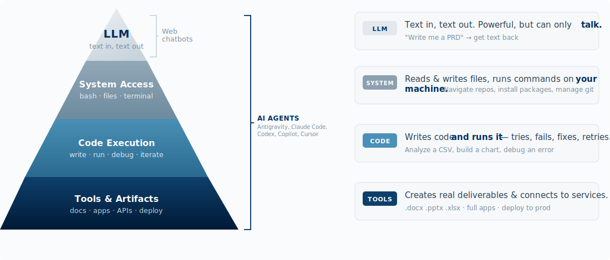

## What is Antigravity?

Google Antigravity is the primary AI agent platform for this course. It is an AI-powered development environment built on VS Code that combines a familiar code editor with an **agent-first** architecture, meaning AI agents can autonomously plan, execute, and verify tasks across your editor, terminal, and browser.

You interact with Antigravity by describing what you want in plain English, and the agent does the work. It wraps the agent experience in a full visual IDE with a dedicated multi-agent orchestration dashboard, making it more approachable than terminal-only agents.

**Why Antigravity for this course:** Antigravity is free during the public preview with generous rate limits on Gemini 3 Pro. It requires no subscription, runs on macOS, Windows, and Linux, and provides a visual interface that lowers the barrier to entry for working with AI agents.

### What Makes an AI Agent Different from a Chatbot?



Web chatbots (Claude.ai, ChatGPT, Gemini) operate at the top of the pyramid which means they can generate text but cannot take action. AI agents like Antigravity operate across all four layers: they read your files, execute code, create deliverables, and connect to external services. Same underlying models, radically different capabilities. Overtime, the web chatbots are incorporating some limited agentic capabilities but still far less than those available in Antigravity.

### The AI Agent Landscape

Antigravity is one of several AI agent platforms. They all share the same core idea which is to allow an AI that can read your files, run commands, search the web, and take multi-step actions on your behalf, but they differ in interface, model, and workflow:

| Agent Platform | Interface | Primary Model | Notable Strength |
|---|---|---|---|
| **Google Antigravity** | Visual IDE (VS Code-based) | Gemini 3 Pro | Multi-agent orchestration, 1M token context, free tier |
| **Claude Code** | Terminal (CLI) + IDE extensions | Claude (Opus, Sonnet) | Unix composability, document skills |
| **GitHub Copilot** | VS Code / JetBrains extension | GPT-4.1 + Claude | Deep GitHub integration |
| **OpenAI Codex** | Terminal (CLI) | GPT-4.1 | OpenAI ecosystem, sandboxed execution |
| **Cursor** | Custom IDE (VS Code fork) | Multi-model | Inline code generation, tab completions |

All of these platforms support the [Agent Skills open standard](https://agentskills.io) and [MCP](https://modelcontextprotocol.io) (Model Context Protocol), meaning skills, rules, and tool integrations you build for one platform increasingly work across all of them. The skills you develop in this course are portable.

## Getting Started

1. [Download Antigravity](https://antigravity.google/download) and install (macOS, Windows, or Linux)
2. Open your project folder
3. Create a project rules file at `.agent/rules/project.md` with your conventions
4. Set the agent mode to **Agent-Assisted** or **Planning** (bottom-right of chat panel)
5. Start prompting in the Agent chat panel

## The Three Surfaces

Antigravity agents operate across three surfaces simultaneously:

1. **Editor** — A VS Code-based code editor where the agent reads, creates, and edits files
2. **Terminal** — A command line where the agent runs commands (install packages, run scripts, execute code)
3. **Browser** — An integrated browser where the agent can click, type, navigate, and record sessions for testing or research

## Agent Tools

These are the specific tools the Antigravity agent has access to:

### File Operations

| Tool | What It Does |
|---|---|
| `view_file` | Read file contents |
| `replace_file_content` | Edit a single section of a file |
| `multi_replace_file_content` | Edit multiple sections of a file in one action |
| `write_to_file` | Create a new file or overwrite an existing one |
| `list_dir` | List directory contents with file sizes |
| `view_file_outline` | Show the structure of a file (functions, classes, sections) |
| `view_code_item` | Jump to a specific function or class definition |
| `view_content_chunk` | Read a section of a large document by position |

### Search

| Tool | What It Does |
|---|---|
| `codebase_search` | Semantic search — find content relevant to a natural language query |
| `search_in_file` | Find relevant content within a specific file |
| `grep_search` | Exact pattern matching across files (regex) |
| `find_by_name` | Search for files and folders by name pattern |

### Terminal

| Tool | What It Does |
|---|---|
| `run_command` | Execute a terminal command (with your approval) |
| `command_status` | Check if a previous command finished and see its output |
| `send_command_input` | Send input to a running interactive process |
| `read_terminal` | Read terminal output from a specific process |

### Web & Browser

| Tool | What It Does |
|---|---|
| `search_web` | Search the internet with summarized results |
| `read_url_content` | Fetch a web page and convert it to readable text |
| `browser_subagent` | Launch a browser session to click, type, navigate, and record |
| `generate_image` | Create or edit images from a text description |

### External Integrations (MCP)

| Tool | What It Does |
|---|---|
| `list_resources` | List available resources from connected MCP servers |
| `read_resource` | Read a specific resource from an MCP server |

MCP (Model Context Protocol) lets you connect Antigravity to external tools like Google Drive, Slack, Jira, databases, and custom APIs.

## Agent Modes

Antigravity offers four levels of agent autonomy. Choose based on the task and your comfort level:

| Mode | How It Works | Best For |
|---|---|---|
| **Agent-Driven** | Full autonomy, no interruptions | Routine tasks you trust the agent to handle |
| **Agent-Assisted** | Agent works but pauses for verification at key steps | Most tasks (recommended default) |
| **Review-Driven** | You approve every step before the agent proceeds | Sensitive or unfamiliar work |
| **Planning** | Agent researches and proposes a plan; you approve before execution | Complex tasks requiring strategy |

Toggle between modes in the Agent panel (bottom-right of the chat interface).

## Rules, Workflows, and Skills

Antigravity uses three mechanisms to customize agent behavior. Understanding the difference is key to getting consistent, high-quality results:

| Mechanism | When It's Active | How You Trigger It | Use It For |
|---|---|---|---|
| **Rules** | Always — injected into every agent response | Automatic | Persistent conventions ("always cite sources", "use professional tone") |
| **Workflows** | On-demand | Type `/workflow-name` | Repeatable saved prompts ("create a diagnostic", "generate unit tests") |
| **Skills** | When the agent determines they're relevant | Automatic or `/skill-name` | Specialized knowledge packages (portable across AI tools) |

### Rules (Always On)

Rules are persistent instructions injected into the agent's system prompt every time it responds.

| Scope | File Location | Applies To |
|---|---|---|
| Global | `~/.gemini/GEMINI.md` | All projects on your machine |
| Project | `<project>/.agent/rules/*.md` | This project only |

**To create rules:** Click `...` in the Agent chat panel → **Customizations** → **+ Global** or **+ Workspace**

Or create the files directly:

```bash
# Global rules
mkdir -p ~/.gemini
nano ~/.gemini/GEMINI.md

# Project rules
mkdir -p .agent/rules
nano .agent/rules/my-rules.md
```

**Example rule file:**

```markdown
- Use professional, executive-ready language
- Cite sources for all factual claims
- When creating deliverables, use clear headers and structured formatting
- Treat all project data files as the source of truth
```

### Workflows (On-Demand)

Workflows are saved prompts you trigger with `/workflow-name`.

| Scope | File Location |
|---|---|
| Global | `~/.gemini/antigravity/global_workflows/*.md` |
| Project | `<project>/.agent/workflows/*.md` |

**Example workflow** (`<project>/.agent/workflows/create-diagnostic.md`):

```markdown
Create a strategic diagnostic for the company specified. Include:
1. Current state assessment (financial performance, market position)
2. Key drivers and root causes
3. Strategic options with trade-offs
4. Recommended path forward with rationale
```

Invoke by typing `/create-diagnostic` in the Agent chat.

### Skills (Open Standard)

Skills follow the [Agent Skills open standard](https://agentskills.io) — the same `SKILL.md` format used across Claude Code, Antigravity, Cursor, GitHub Copilot, Codex, and other AI tools. A skill you create for one tool works in all of them.

| Scope | File Location |
|---|---|
| Global | `~/.gemini/antigravity/skills/*/SKILL.md` |
| Project | `<project>/.agent/skills/*/SKILL.md` |

Skills differ from workflows in that the agent can automatically invoke them when your request matches the skill's description, without you typing `/`. There are [700+ community-built skills](https://github.com/sickn33/antigravity-awesome-skills) available for common tasks like creating spreadsheets, presentations, PDFs, and more.

## The Manager View

The Manager View is Antigravity's multi-agent orchestration dashboard. It lets you:

- Spawn multiple agents working on different tasks simultaneously
- Track each agent's progress, artifacts, and status
- Review artifacts (task lists, implementation plans, screenshots, browser recordings)
- Comment on artifacts Google-Doc-style — the agent incorporates your feedback without restarting

Access it from the top-left of the Antigravity window (look for the grid/manager icon).

This is particularly useful for consulting work where you might want one agent researching a company's financials while another analyzes industry trends and a third drafts a slide structure — all running in parallel.

## Knowledge Base

Antigravity maintains a persistent knowledge base at `.gemini/antigravity/brain/` within your project. As agents work, they automatically save:

- Project conventions and preferences
- Key insights from previous sessions
- Patterns discovered during analysis

Future agents read this knowledge before starting, so Antigravity improves over time on your project without you repeating instructions. This happens automatically — you don't need to tell the agent what to remember.

## Context Management

Antigravity's ~1M token context window means your entire project often fits in memory without truncation. When limits are approached, the system manages context automatically through:

1. **Knowledge Item Distillation** — A dedicated subagent extracts key insights into searchable entries
2. **Checkpoint Truncation** — Periodic snapshots; truncates to the most recent when needed
3. **Trajectory Summaries** — Compact overviews of previous conversations loaded at session start
4. **Code Item Tracking** — Avoids re-reading unchanged files
5. **LRU Cache** — Automatically evicts least-relevant context

You generally don't need to manage context manually — Antigravity handles this behind the scenes.

## Resetting Antigravity

To start completely fresh:

```bash
# Remove all global config (rules, skills, knowledge base, workflows)
rm -rf ~/.gemini

# Remove project-level config
rm -rf <project>/.agent

# Recreate clean structure
mkdir -p ~/.gemini
touch ~/.gemini/GEMINI.md
mkdir -p <project>/.agent/rules
```

## File Structure Summary

```
~/.gemini/
├── GEMINI.md                              # Global rules (all projects)
└── antigravity/
    ├── brain/                             # Knowledge base (auto-managed)
    ├── skills/*/SKILL.md                  # Global skills
    └── global_workflows/*.md              # Global workflows

<your-project>/
└── .agent/
    ├── rules/*.md                         # Project rules
    ├── workflows/*.md                     # Project workflows
    └── skills/*/SKILL.md                  # Project skills
```

## Additional Resources

- [Antigravity Documentation](https://antigravity.google/docs/agent)
- [Getting Started Codelab](https://codelabs.developers.google.com/getting-started-google-antigravity)
- [Skills Tutorial](https://codelabs.developers.google.com/getting-started-with-antigravity-skills)
- [Agent Skills Open Standard](https://agentskills.io)
- [Community Skills Collection (700+)](https://github.com/sickn33/antigravity-awesome-skills)
- [MCP Server Directory](https://antigravity.codes/)
